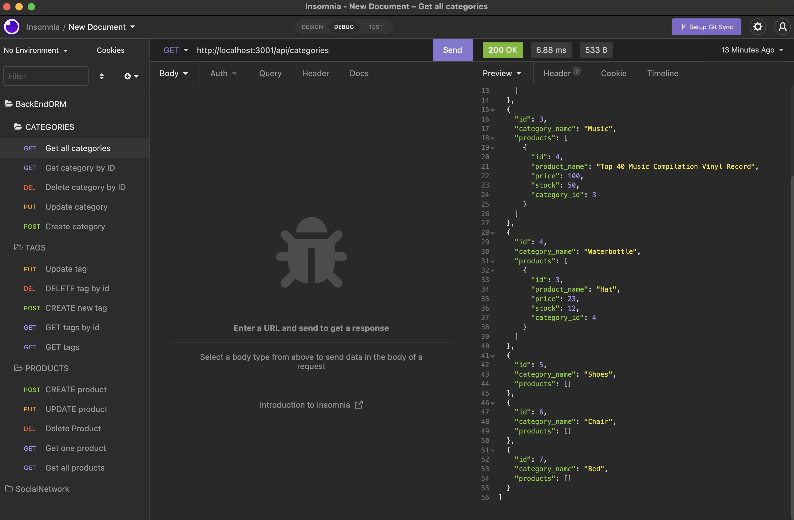
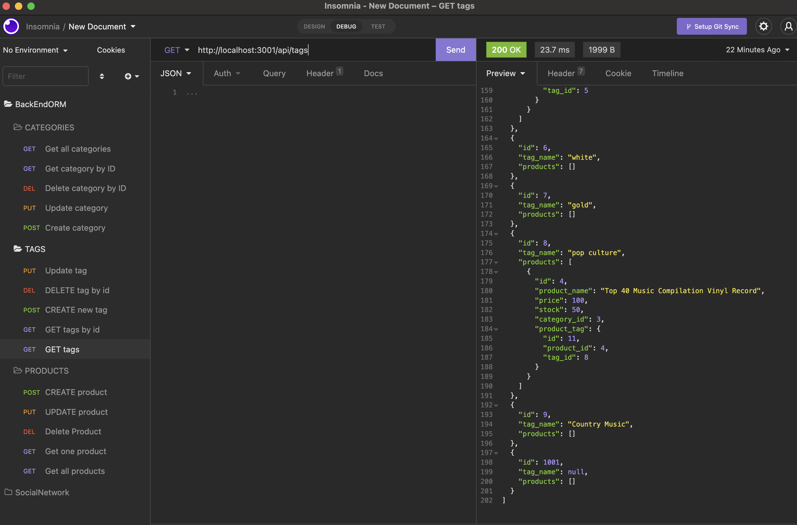
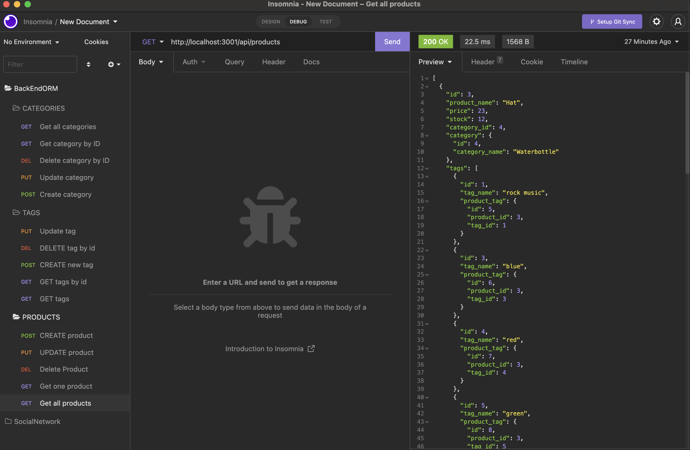
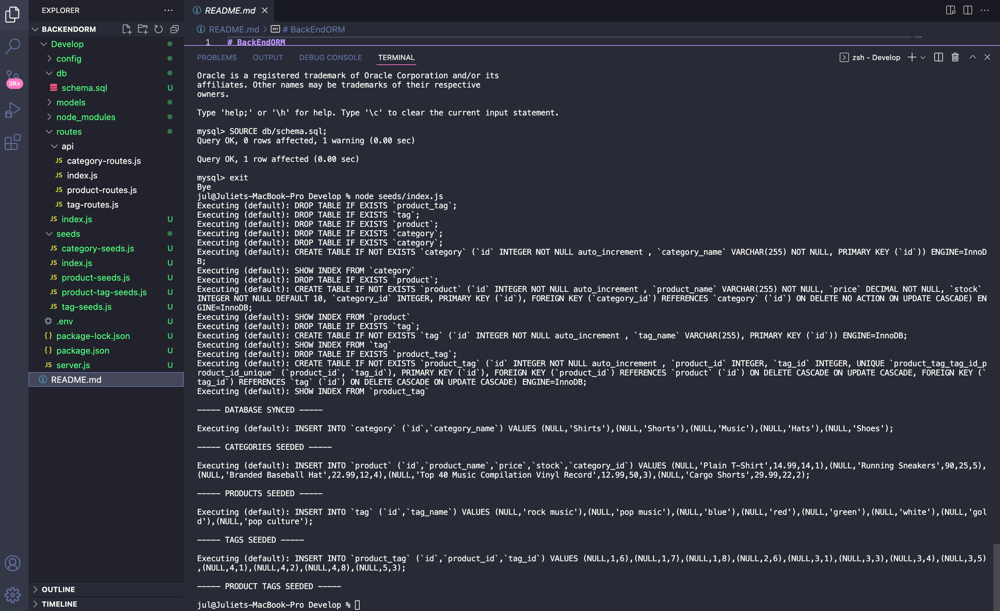

# BackEndORM
Object-Relational Mapping(ORM) Challenge: E-Commerce Back End

# Description
This is a back-end application for an E-Commerce site using a MySQL database.

# Technologies
- MySQL
- Express
- Sequelize
- dotenv.

# Application Link
https://drive.google.com/file/d/1OHRARpj80c1iZV86x3vfEI-rdd5Wgcjl/view

# Screenshot

